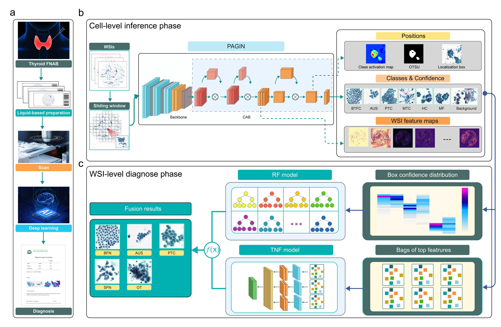

# Thyroid Fine Needle Aspiration (FNA) biopsy Algorithm

<div align="center">
  
</div>  


## Introduction
Accurately distinguishing between malignant and benign thyroid nodules through fine-needle aspiration (FNA) cytopathology is crucial for appropriate therapeutic intervention. However, cytopathologic diagnosis is time-consuming and hindered by the shortage of experienced cytopathologists. Thus, reliable assistive tools are urgently needed to improve cytopathologic diagnosis efficiency and accuracy. We developed and validated an AI system for assisted diagnostics of thyroid nodules with a total of 17966 WSIs of 8426 smears from 7420 patients with thyroid nodules from four centers. To the best of our knowledge, this is the largest thyroid FNA dataset with experienced cytopathologists’ supervision and following the TBSRTC guideline.

This repository contains the train&test code for the patch-level classification model (backbone + proposed CAB), and the train&test code for WSI-level classification (TNF model & RF model) that were mentioned in the paper.

## Requirements

- Python packages
  - tensorflow>=2.3.0


## Train Patch-Level Model
To train the patch-level classification model, Add patch images to ./data/patches/ and the corresponding cvs file to ./data/csv_data/

Then run the following command

```bash
python train_patches.py --cfg cfgs/train_cfg_effi_cab.yaml
```

## Test Patch-Level Model
To test the patch-level classification model, Add patch images to ./data/patches/ and the corresponding cvs file to ./data/csv_data/

The csv file should contain the wsi filenames tp which the patch images used for training belong.

Modify *do_train* to *False*, *load_model_path* to trained checkpoint path in the corresponding cfg file, and add test csv file to ./data/csv_data/

Then run the following command

```bash
python test_patches.py --cfg cfgs/test_cfg_effi_cab.yaml
```

## Patch Images Dataset folder structure
Whithin the ./data/patches/ folder, the folllowing structure is expected.

    patches/
    ├── WSI001
    │   ├── BFN
    │     ├── patch001_BFN.png    
    │     ├── patch002_BFN.png  
    │     ├── ...
    │   ├── PTC
    │     ├── patch001_SUS_PTC.png    
    │     ├── patch002_PTC.png  
    │     ├── ...
    │   ├── AUS
    │   ├── ...
    ├── WSI002
    ├── WSI003
    ├── ...


## Train WSI-Level Model
To train the WSI-level classification model, Add .pkl files to ./data/pkl/ and the corresponding cvs file to ./data/csv_data/

Then run the following command

```bash
python train_tnf.py --cfg cfgs/train_val_test_cfg_tnf.yaml
python train_rf.py --cfg cfgs/train_val_test_cfg_rf.yaml
```

## Test WSI-Level Model
Modify *do_train* to *False* in the corresponding cfg file and run the following command
```bash
python train_tnf.py --cfg cfgs/train_val_test_cfg_tnf.yaml
python train_rf.py --cfg cfgs/train_val_test_cfg_rf.yaml
```

## Pickle file structure
Each pickle file contains metadata of the corresponding WSI image and its patch-level inferencing results

Here is an example of what the .pkl should look like

    { 
     "result": {  
       "bfn": [
        [xmin1,ymin1,xmax1,ymax1,conf1],
        [xmin2,ymin2,xmax2,ymax2,conf2],
        ...
       ],
       "aus": [...],
       "ptc": [...],
       "mtc": [...],
       "fn": [...],
       "ss": [...],
     }, 
     "fea_list": [[...], [...], ...],
     "mpp": 0.2065, 
     "size": (69888, 67200),
     "patch_size": 924 # patch size corresponding to its highes level dimensions
     
     }

Note that *fea_list* contains features of the patches with the highes confidence of each cell class.
